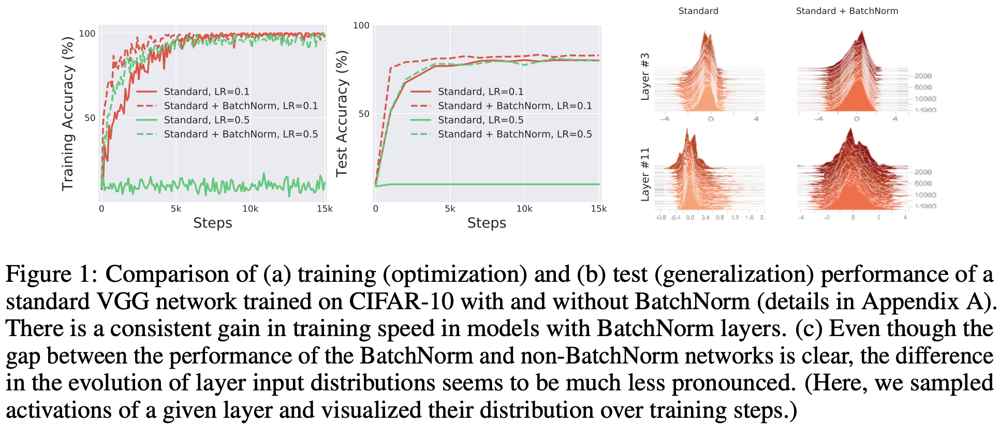
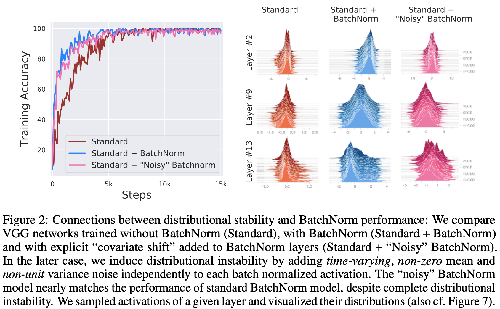
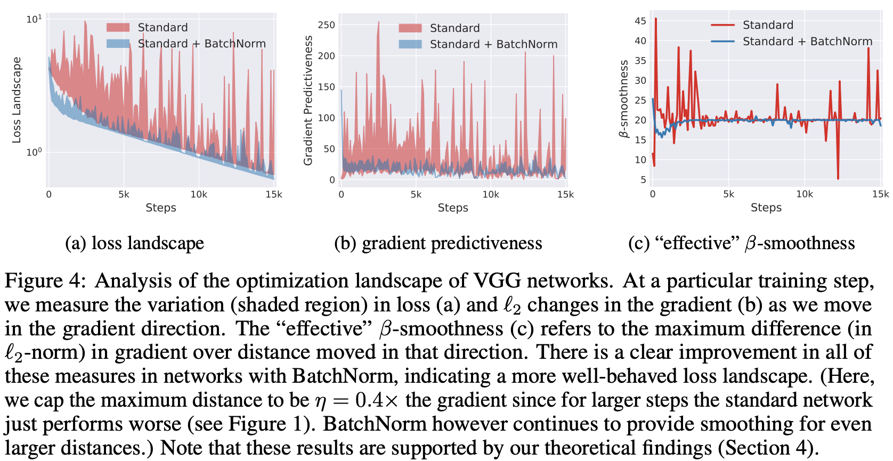

## Paper: [_**How Does Batch Normalization Help Optimization?**_](https://papers.nips.cc/paper/7515-how-does-batch-normalization-help-optimization.pdf)

*Shibani Santurkar, Dimitris Tsipras, Andrew Ilyas, Aleksander Madry*

A very interesting paper that I read recently wherein the authors study why does batch normalization help with optimization. Deep learning, I have started to believe is very little understood and is strongly dominated by empirical results. This is applicable to a very popular trick - Batch normalization as well. Batch normalization is undoubtedly one of the most prominent advances in training neural networks. It allowed training of deep learning systems with a much higher learning rate - leading to faster convergence in a much robust way. 

The authors of this papers argue that contrary to the widely accepted belief - Batch normalization works because it smoothes the loss function landscape and the gradients. It was understood till now that batch normalization deals with what is called internal covariate shift. Since the parameters of all the layers are updated simultaneously, the inputs to all the layers change as well. This would cause a problem since the gradient was evaluated considering a previous layer input but now that has changed and so gradients wouldn't be as effective. 

To deal with it, Ioffe et. al suggested a technique to normalize the layer activations accross the batch to change the first two moments of the layer distribution (mean and variance) to 0 and 1 respectively. The strength of their paper was to include the normalization in the network architecture and modify the backpropogation accordingly. This resulted in very robust training methods for neural networks allowing for higher learning rates. Ioeffe et. al argued that since the distribution of inputs to all layers is not changing, the training can converge much quickly, as was found empirically, and allow use of larger step sizes.

On the other hand, this paper suggests that the batch normalization rather smoothens the loss function and the gradients, thus making the gradient descent more stable. It substantiates its claims empirically as well as theoretically. The difference between layer distributions with and without batch norm was not significant even though batch norm boosted the network training [Image from paper].

By introducing noise (the internal covariate shift) in batch normalized networks it was still found that the training converged at the same rate [image from paper].

The authors claim that Batch Normalization improves the Lipschitzness of both the loss and the gradients thus making training process smoother by preventing sudden change in loss with the change in parameters. This is visible in the figure below [from paper] which shows the plot of loss and gradients in the direction of gradient during the training process. The loss function and gradients are seen to be smoothened by batch normalization.

The authors also state theoritical results on the impact of batch normalization on the Lipschitzness of the loss function. Also, other normalization strategies have comparable impact on the performance as batch normalization.

Thus the paper challenges the existing understanding of batch normalization and provides deeper insights as to why this technique help in training neural networks.