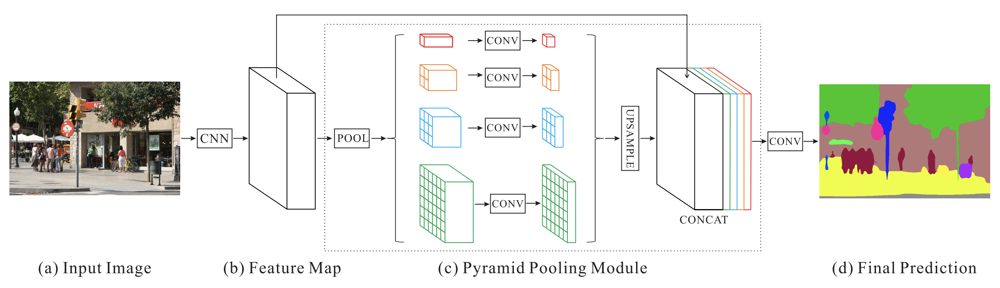

## Paper: [_**Pyramid Scene Parsing Network**_](https://arxiv.org/abs/1612.01105)

*Hengshuang Zhao, Jianping Shi, Xiaojuan Qi, Xiaogang Wang, Jiaya Jia*

This network presented a unique way to incorporate global priors for semantic segmentation and scene parsing of images. The contemporary scene parsing methods focussed on local high resolution features. This paper exploits global image-level information by different region-based context aggregation via pooling.  The local and global features together result in a very reliable final prediction of pixel classes.

The authors note some observations about the existing networks:

* **Mismatched relationship**: This relates to contextual relationship between objects which the authors argue is universal. For example a plane can be better classified if the surrounding is known to be road or sky. Thus contextual information is important for pixel classification.
* **Confusion categories**: FCN predicted some parts of the same object differently. Such predictions should be avoided by exploiting relationship between categories.
* **Inconspicuous classes**: An object can be of multiple scales in the image and hence different sizes of filters should be used for aggregating information.

Hence the authors propose a pyramid pooling system to aggregate information. As shown in the image below:

Thus a pyramid of pooling filters is used to aggregate information at different scales. The authors used a four-level pyramid pooling module with $$1\times1$$,$$2\times2$$ ,$$3\times3$$ and $$6\times6$$ filter sizes though the number of levels and sizes can be modified. The depth of these layers is reduced to $$1/N$$ where $$N$$ is the number of levels in the pyramid. These layers are then upsampled and concatenated with local features extracted using a pretrained Resnet model. This is followed by a final convolution layer to generate the final predictions.

This kind of heirarichal pooling performs better than global pooling that had been proposed earlier. It is important to note here that the network uses bilinear interpolation for upsampling rather than deconvolution. 

The architecture additionally proposes an auxillary loss by predicting at the fourth stage as well as the final stage and letting the gradients from both the losses backpropogate. This idea is similar to GoogLeNet inception module. This auxillary loss is abandoned during testing.

PSPNet surpassed the existing state of the art methods. It achieved first place in ImageNet scene parsing challenge 2016. It came first in PASCAL VOC 2012 benchmark and Cityscapes benchmark as well.