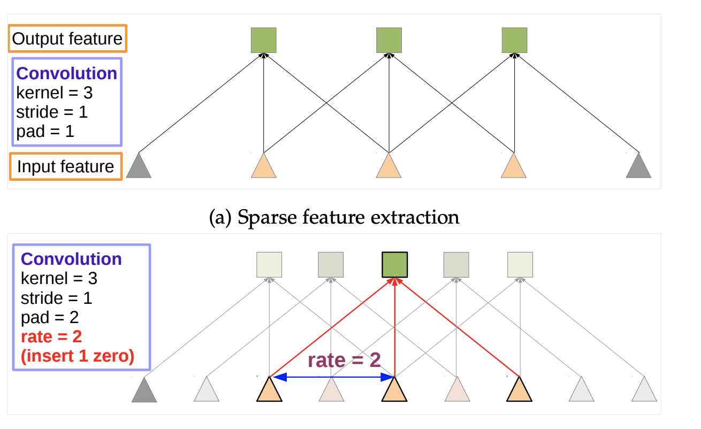
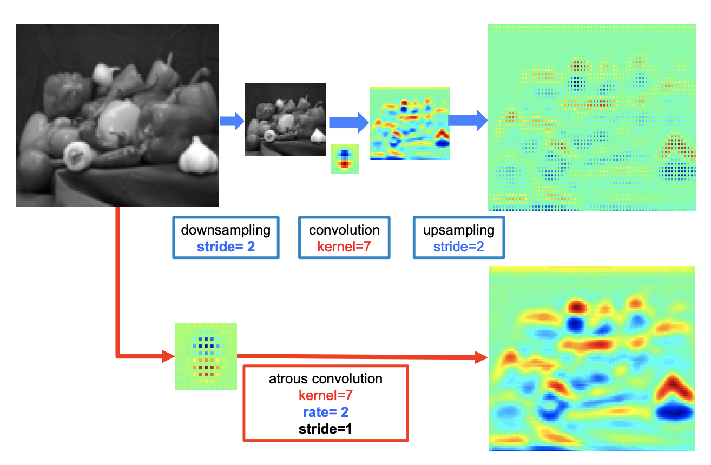
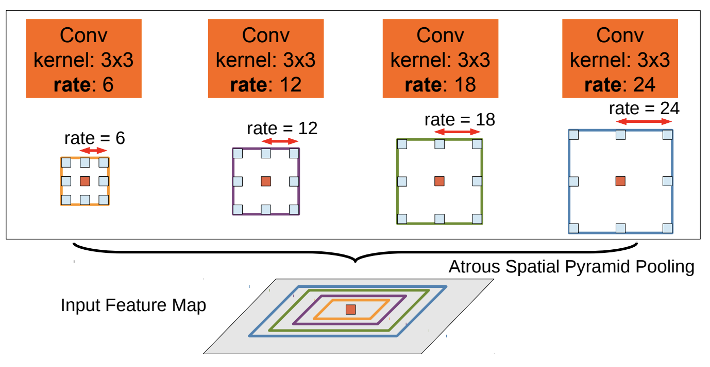
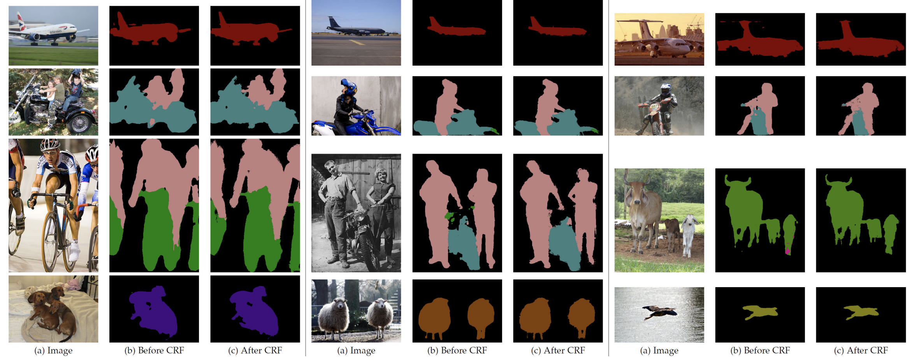

## Paper: [_**DeepLab: Semantic Segmentation with Deep Convolutional Nets, Atrous Convolution, and Fully Connected CRFs**_](https://arxiv.org/abs/1606.00915)

*Liang-Chieh Chen, George Papandreou, Iasonas Kokkinos, Kevin Murphy, Alan L. Yuille*

DeepLab was one of the major improvements for semantic image segmentation where each pixel is assigned a semantic label such as "car", "road", etc. There have been various improvements since the original DeepLab version was published. The latest version (as of this post) can be found [here](https://arxiv.org/abs/1802.02611). In this post I will be reviewing this [version](https://arxiv.org/abs/1606.00915).

There are three major contributions of this paper based on the following problems with the methods existing at that time:

* Reduced feature resolution by using pooling operations by DCNNs
* Existence of objects at multiple scales
* Reduced localization due to translation invariance inherently in DCNNs.

This work makes three significant contributions:

* ### __*Atrous Convolution*__: 

  Inspired by the literature of wavelet transform, the authors proposed Atrous convolution which effectively increase the spatial resolution of features and also increases the field of view of filters at any layer. In case of 1-D, this can be represented as:

  $$y[i] = \sum_{k=1}^{K}x[i+rk]w[k]$$

  Basically, this can be thought of as upsampling the filters with zeros filled in the holes and then convoluting with the input. The number of parameters-non zero values remain the same and hence allows us to control field of view and spatial resolution. Below image[from paper] is a good visualization.
  

  The rate $$r$$ controls sampling rate and can be changed to obtain desired spatial resolution. $$r=1$$ gives us the standard convolution. Below figure shows how atrous convolution increases spatial resolution as compared to traditional pooling->convolution->upsampling layers:
  

  Atrous convolution with rate $$r$$ increases filter size from $$k\times k$$ to $$k + (k − 1)(r − 1) \times k + (k − 1)(r − 1)$$ by filling $$r-1$$ zeros inside filter keeping the number of parameters same.

* ### __*Atrous Spatial Pyramid Pooling*__ : 

  Inspired by the R-CNN spatial pyramid pooling proposed by He. et al (2014), authors multiple taros convolution filters with different sampling rate at each layer parallely. These features are fused together to generate the final result. Below figure gives an idea:

  

  This helps us deal with objects at different scales.

* ### *__Fully Connected Conditional Random Field__*:

  Authors try to decouple the components for semantic recognition and localization accuracy by employing fully connected CRF model. As opposed to traditional short range CRFs, a fully connected CRF model is integrated by minimizing the function:

  $$E(x) = \sum_{i}\theta_i(x_i) + \sum_{i}\theta_{ji}(x_i,x_j)$$

  $$\theta_i(x_i) = -\log(P(x_i))$$

  $$\theta_{ij}(x_i,x_j) = \mu(x_i,x_j)[w_1\exp(-\frac{\|p_i-p_j\|^2}{2\sigma_\alpha^2}-\frac{\|I_i-I_j\|^2}{2\sigma_\beta^2})] + w_2\exp(-\frac{\|p_i-p_j\|^2}{2\sigma_\gamma^2})$$

  where $$\mu(x_i,x_j)$$ is 1 if $$x_i \neq x_j$$and zero otherwise. 

DeepLab set the state of the art at the PASCAL VOC-2012 semantic segmentation task, reaching 79.7% mIOU in test set. Some of the qualitative results from paper are shown below:

