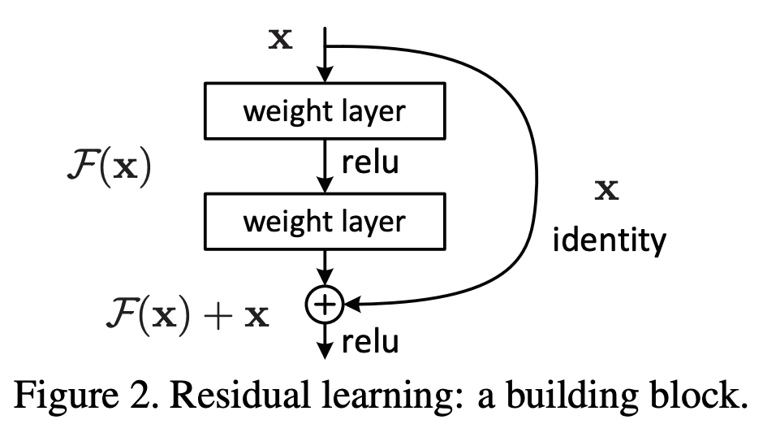
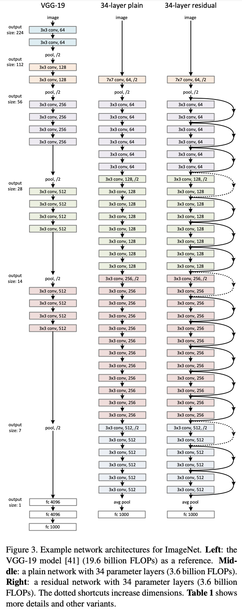

## Paper: [_**Deep Residual Learning for Image Recognition**_](https://arxiv.org/abs/1512.03385)

*Kaiming He, Xiangyu Zhang, Shaoqing Ren, Jian Sun*

Since the advent of Deep Learning, Resnets are undoubtedly one of the most significant advances in it. The paper has more than 18k citations as of this post and has found applications in vision, language, speech and even Alpha Go. The work achieved 3.57% error on ImageNet test set and won $$1st$$ place on the ILSVRC 2015 classification task.

This work allowed training of very deep networks possible thus allowing to fully utilize the potential of deep neural networks. Authors submitted a network with 152 layers which is 8x deeper than VGG net but having lower complexity.

The work was inspired by a simple question: *Is learning better networks as easy as stacking layers?* . Depth had shown of significance in previous works but training very deep networks led to contrary observation - training error decreased with increasing layers. This was in contradiction to traditional view of training loss decreasing with overparmetrization. It was attributed to the fact that as the networks get deeper, they suffer from the problem of exploding or vanishing gradients.

 The authors argued that deeper networks should perform at least better than shallow networks since any shallow network can be represented by a deep network just by making the end layers to perform identity function.

Hence arose the idea that layers should learn residual of a mapping rather than mapping itself. Simple put for an input $$X$$, each layer should learn residual $F(X)$ resulting in the output of the layer:

$$Y = F(X) + X$$

This can be modeled by adding simple skip connections from previous layers. Below is a simple residual unit:

These do not add any additional parameters and allow us to train very deep networks. The authors have shown by experiments that learned residual activations have smaller responses in general suggesting that most mappings are very close to identity mappings. In case the dimensions of $$X$$ and $$F(X)$$ are different a linear transformation can be performed on $$X$$ so that

$$Y = F(X) + W_sX$$

Below is an image of a very deep network: resnet being the same depth has similar number of parameters but performs much better than a plain network.

To improve the training time for very deep networks, the residual block was modified by adding $$1\times 1$$ convolution blocks before and after normal convolution to reduce number of features.

The authors went to the extent of training network with over 1000 layers on CIFAR-10 dataset and found that test error is worse than 110 layer network, possibly due to overfitting.

Resnet also won the first prize for ImageNet Detection and Localization as well as for COCO Detection and COCO Segmentation.