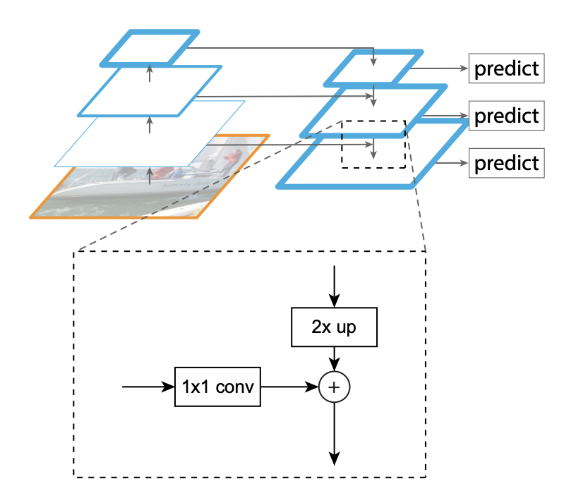
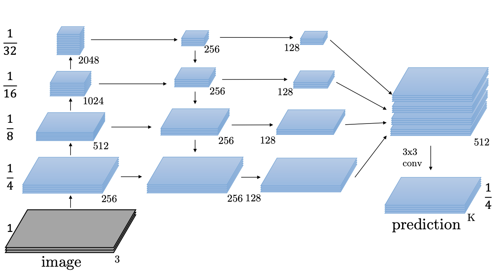

## Paper: [_**Feature Pyramid Networks for Object Detection**_](https://arxiv.org/abs/1612.03144)

*Tsung-Yi Lin, Piotr Dollár, Ross Girshick, Kaiming He, Bharath Hariharan, Serge Belongie*

To detect or segment objects at multiple scales, feature pyramids have been employed in numerous architectures. Feature pyramids however come at the cost of excessive compute and memory requirements. This paper presents a simple way to develop feature pyramid networks using the existing convolutional networks without any extra headache. This formulation has easily achieved state of the art results on COCO detection challenge.

Since objects in images occur at different scales, we need a scale invariant features to represent these objects and perform tasks such as detection and segmentation. Feature pyramids have been used traditionally in computer vision as well as in modern CNN architectures but these required higher inference time.

FPN leverages the convolutional networks' pyramidal feature heirarchy to provide a general purpose feature pyramid that can be used across tasks. In this paper the authors have built FPN taking Resnet as the backbone. It involves two components:

### __Bottom-up pathway__:

This is the simple feed forward path of the resnet where features at end of each stage (layers with same size are a stage) represents one level of the feature pyramid. Specifially for resnets, these are the last blocks of conv2, conv3, conv4 and conv5.

### __Top-down pathway__:

In this pathway, features from higher levels of the pyramids, which contain semantic information, are upsampled and laterally connected with same level of the bottom-up pyramid to produce a lower level of top-down pyramid. That is, each level in top-down pyramid is upsampled to resemble the size of next level (in this case, upsampled by a factor of 2) and added with $$1\times1$$ conv result of same level of bottom-up path. Each level in this pyramid has fixed 256 features. Above image [from paper] shows the process of upsampling and lateral connection:

This pyramid network can then be utilized for various tasks like segmentation, object detection etc.

The paper contains the details of the applications of these pyramids to different networks like RPN, Fast/er-RCNN, etc.

I will talk about one application of this for image segmentation presented by the authors in [this](http://presentations.cocodataset.org/COCO17-Stuff-FAIR.pdf) presentation. Here the features of each level in the pyramid are convolved with 2 $$3\times3$$ filters and then the concatenation of these features is convolved with $$3\times3$$ filter again to produce $$C$$ channels - the number of possible classes. Below is the image:

Similarly these pyramid features can be easily extented to other applications as well.